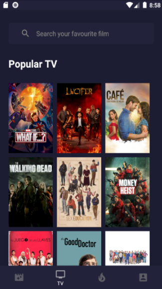

# Android Movie App

This project is an assignment from my android training. I was given an assignment to make a simple android project using Java with theme of movie catalog.
The API is from [TMDB API](https://www.themoviedb.org/settings/api).

Features available in this application are:
- Login & Logout
- Movie and TV List
- Favourite Movie & TV
- Search
- Change Language

### Login & Logout
Using Shared Preference to store user session based on time. We use 24 hours to maintain user session, no extend time.
When user logout from the application, the table on the database will be removed.

### Movie and TV List
Using Recycler View and GridLayoutManager to show the item to the view. We use 2 [TMDB APIs](https://developers.themoviedb.org/3/getting-started/introduction) to get movie and tv list (popular and upcoming).
When we load movie & TV list from API, we save them in our database SQLite using Android Room.

### Favourite
Using Android Room to save the favourite film choosen by user.

### Search
In the first search, we look for the film name in our database, but if there are no items we are looking for in the database, we will use [TMDB API](https://developers.themoviedb.org/3/getting-started/introduction) for searching movie.

### Change Language
We only provide 2 languages in this application (English and Indonesia). Using Locale android feature to change our application language.
